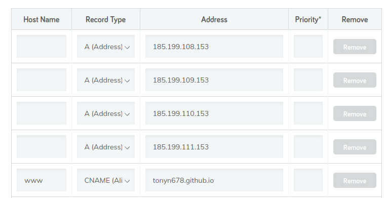

## Inspiration
I had always wanted to build my own website, no Wordpress or any third-party hosting bloats that rip your pocket! This is also for storing information and experiences I gained throughout my learning journey in the world of tech and engineering so I don't have to crawling through my dusting physical A4 notebooks or proprietary gg docs :/

## Set Up HUGO
I built this website with Hugo and Github Page, a cool fast minimalist combo for hosting with no databases, just raw mark-down texts and basic html, css, js skills :)

1. Download [Hugo](https://gohugo.io/getting-started/quick-start/)

2. Set up 2 new Github repositories: "USERNAME.github.io" and "blog" 
   
   (*blog* is where I keep all the drafts and themes so I could modify locally, *USERNAME.github.io* is a github page for publishing the real website in the "public" folder of hugo workspace). 

3. Clone your *blog* repository to your local machine `git clone https://github.com/USERNAME/blog`.

4. `cd blog` and create a hugo workspace `hugo new site myblog`.

5. `cd myblog`
   `git clone https://github.com/binokochumolvarghese/lightbi-hugo themes/lightbi-hugo` ([lightbi-hugo](https://github.com/binokochumolvarghese/lightbi-hugo))

6. Create a git submodule of public folder, link it to the publishing page *USERNAME.github.io*, We do this so everytime we finalise with 'hugo', the new code will be auto pushed to 'public' and we could cd into 'public' to git push our website into github.io repo:
   `git submodule add -b main https://github.com/USERNAME/USERNAME.github.io.git public/` ([Refs](https://www.youtube.com/watch?v=LIFvgrRxdt4&list=WL&index=23))
   
   *NOTE: if error, delete the folder *public* !

7. Now you can customise any html, css, js files you see in *themes* folder and preview with `hugo serve`, go to `http://localhost:1313/` to view your website in development mode.

8. You can publish new posts with `hugo new content content/posts/my-first-post.md`.

9. Once you satisfy with everything simply publish the website by typing `hugo`, remember to delete everything in *public* folder everytime you publish to avoid any collision cause `hugo` will generate a new website in *public* folder everytime.

10. Add, Commit and Push to Gihub repos and enjoy your page at *USERNAME.github.io*. 

---
## How To ?
### 1. Link Images ([reference](https://discourse.gohugo.io/t/how-to-add-image-to-hugo-with-local-and-remote/41391))
#### Option 1: Decentralized Images (images saved separately with each posts)
- Instead of putting all the posts in the "posts" directory which is super messy later on, you could create separate directories for each post and create an index.md in each folder along with prefered images:


*NOTE: if error, specify the image with "./a.jpg" because different Hugo template has different way of specifying relative address (or just cancel and hugo serve again) !

#### Option 2: Centralised Images (all images saved in static directory)
##### Step 1: Organise Your Image Files
1. Navigate to the `static` directory in your Hugo project:
   ```bash
   cd <your-hugo-project>/static
   ```

2. Create a folder to store your images (e.g., `images`):
   ```bash
   mkdir images
   ```

3. Add your image file(s) to the newly created folder:
   ```bash
   cp /path/to/your/image.jpg <your-hugo-project>/static/images/
   ```

##### Step 2: Link the Image in Your Post
1. Open your post file in the `content` directory (e.g., `content/posts/example.md`):
   ```bash
   vim content/posts/example.md
   ```

2. Use the Markdown syntax to add the image:
   ```markdown
   
   ```
   - Replace `Alt text describing the image` with a short description of the image.
   - Adjust the path (`/images/image.jpg`) to match your file location.


##### Step 3: Resize or Align Images (Optional)
###### Resize Images
Use the `width` and `height` attributes in HTML within your Markdown file:
```markdown

```

###### Centre Align Images
Wrap the image in a `<div>` tag with a `style` attribute:
```markdown
<div style="text-align: center;">
  
</div>
```

##### Step 4: Test Your Post
1. Start the Hugo development server:
   ```bash
   hugo serve
   ```

2. Open your browser and navigate to `http://localhost:1313` to verify that the image appears correctly.

### 1a. Canvas of images
Here’s a custom Hugo shortcode that creates an image gallery in a masonry style using GLightbox, allowing you to specify a folder containing images. This approach will display images from a specified folder in a masonry layout, and each image will open in a lightbox when clicked.

**Shortcode**:  
```
{{/*< img_gallery  folder="img/travel/" >*/}}
```


### 2. Link custom domain to Gihub Page ([reference](https://www.youtube.com/watch?v=k3Y3c5WlAfc&list=WL&index=1))

#### Step 1: Add Github's DNS records to domain hosting site
1. Go to this [website](https://docs.github.com/en/pages/configuring-a-custom-domain-for-your-github-pages-site/managing-a-custom-domain-for-your-github-pages-site),
    go the "Configuring an apex domain" and at step 5, copy the 4 IP addresses.
2. Go to domain provider and edit your domain's DNS settings to include those 4 IP addresses with a "www" host name with CNAME record pointing to your Gihub Pages:

     

**OR through Cloudflare Nameservers**

[Add DNS Records to Cloudflare](/projects/raspberry-pi-server/#1-conflict-between-nameservers-and-manual-dns-on-domain-hosting-platform)
#### Step 2: Add Customed Domain to Github Page
1. Go to Github Page repository <name>.github.io, go to Settings then Pages.
2. Add your domain to "Custom domain" section.
3. Wait up to a day for https to be active for secure connection.

---
## References
- For more information regarding the theme, click [here](https://hba.sid.one/posts/)
