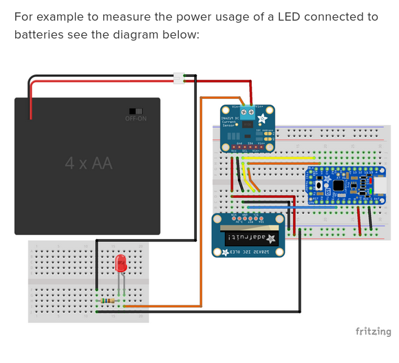
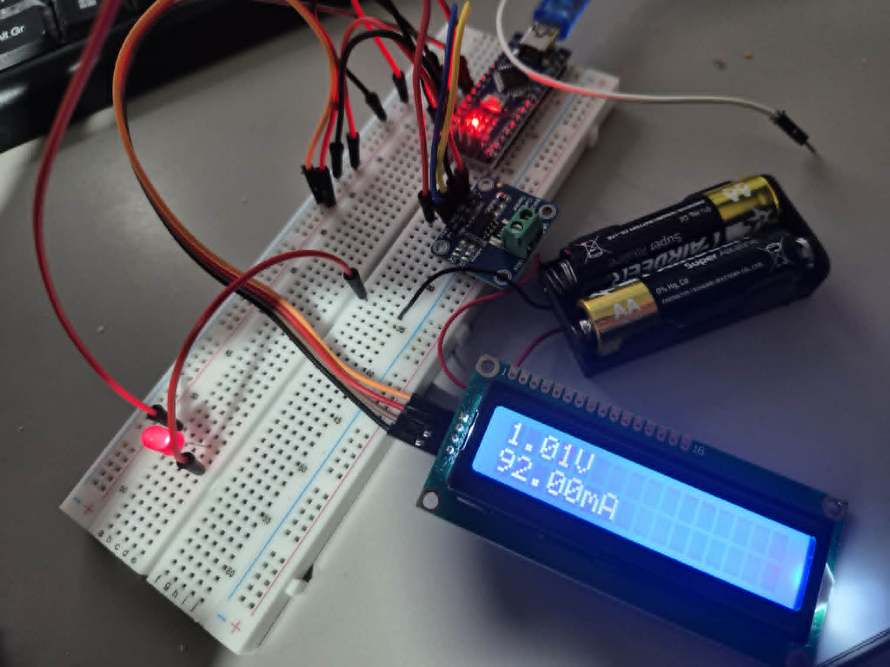

# Building a DIY Power Meter & Logger with Arduino Nano and INA219

In this project, I'll walk you through how I built a simple but accurate power meter and data logger using three main components: an Arduino Nano, the INA219 current/voltage monitoring IC, and a 16×2 LCD display. The goal was to create a compact device that can measure voltage, current, and power in real time—and also log the data for later analysis.

## Explanation of why this circuit is **WRONG** for only measuring the BATTERY, not shunt voltage through load!!!

- The SDA and SDL pins of the INA219 and the LCD Display must be connect to the A4 and A5 pins of the Nano respectively ( A4 and A5 are in charge of I2C communication, on Arduino Uno board it has its own SDA and SDL pins).
- The LCD Display is powered by 5V from 5V pin of Nano.
- LOAD's VCC is connected to V- pin of INA219 while its GND is connected to GND. (load is literally anything that consume power ie. resistor convert electricity to heat, IC got powered by power, ....
- Battery pack is ~3V, this is measured in the LCD to be around 3.2V across the load; The load is there for current to flow through so INA219 can measure shunt voltage; BATT+ --> INA219's V+, BATT- --> GND.

## TRUE schematic for measuring shunt voltage across a LOAD

LOAD's GND --> BATT's GND, LOAD's VCC --> V- of INA219 !!!

The shunt voltage (voltage drop) across LED is around 1.0V with 92mA current

## Understanding the INA219 Power Monitor

The INA219 is the key component that makes this power meter project both accurate and easy to build. It's a precision high-side current and voltage sensor developed by Texas Instruments, and it allows the Arduino to measure:

- Bus Voltage (the voltage of the system you're powering)
- Shunt Voltage (the small **voltage drop** across a shunt resistor)
- Current (calculated using the shunt voltage)
- Power (voltage × current)

What makes the INA219 especially useful for hobby projects is that it handles all the difficult analog measurements internally and provides clean, digital readings over I²C (basically mentioning SDL and SDA pins on the module apart from VCC & GND), so you don't need ADC calibration or amplification stages.

## Why You Need a Load in a Power Measurement Circuit

When using the INA219 (or any current-sensing device), you must have a **load** connected in the circuit. The load is the component, module, or device that actually consumes electrical power, such as a motor, LED strip, battery charger, or any electronic device under test.

### 1. Current Only Flows When There Is a Load

The INA219 measures current by detecting the small voltage drop across the shunt resistor. But current only flows if there is something drawing power. Without a load, there is no current through the shunt resistor — so the INA219 will read: *0 mA* and *0 mW*.

### 2. Power = Voltage × Current

Electrical power can only exist when both voltage and current are present. Even if the power supply is connected, without a load:

- Voltage is present
- But current is zero

**This means the power is also zero.**

### 3. The INA219 Needs a Voltage Drop to Measure Current

The INA219 works by measuring the tiny voltage drop across its built-in shunt resistor. If no load is connected, no current flows, and the shunt voltage is: **0 volts**. With nothing to measure, the sensor cannot calculate current or power.

### 4. The Load Determines Real-World Behaviour

Different loads draw different amounts of current — and this is what makes the power meter useful. A fan, LED strip, or DC motor will each produce unique readings. Measuring a real load lets you:

- Profile power consumption
- Test efficiency
- Monitor battery discharge
- Compare different devices

### 5. Without a Load, You're Only Measuring the Power Supply Itself

If there's no load, the INA219 ends up monitoring nothing but the open-circuit voltage of your power supply — which isn't useful for a power meter or logger.

### Summary

You need a load because it creates current flow. That current flow creates a voltage drop across the shunt resistor. The INA219 uses that voltage drop to calculate current and power.

## Reference

- https://www.adafruit.com/product/904
- https://learn.adafruit.com/pro-trinket-power-meter/usage
- https://lastminuteengineers.com/i2c-lcd-arduino-tutorial/
- https://www.instructables.com/Make-Your-Own-Power-MeterLogger/
