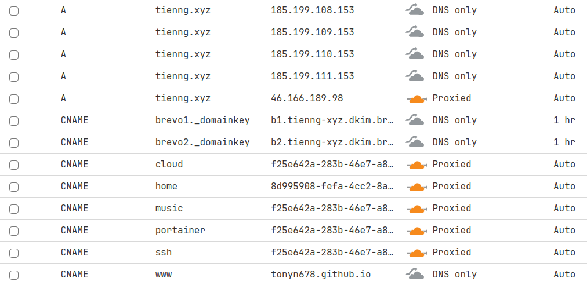

# Setting Up a Raspberry Pi Home Server with Docker

A Raspberry Pi can be transformed into a powerful and lightweight home server with the right configuration. In this guide, I will walk you through my setup process, starting from installing the Raspberry Pi OS Lite to configuring Docker containers and setting up essential services for remote file access, media streaming, and more.

---

## Step 1: Install 64-bit Raspberry Pi OS Lite

To maximise performance and compatibility, I opted for the 64-bit version of Raspberry Pi OS Lite with no GUI. Here are the steps I followed:

1. **Download the OS**: Visit the official Raspberry Pi website and download the latest [64-bit Raspberry Pi OS Lite](https://www.raspberrypi.com/software/).
2. **Flash the SD Card**: Flash the OS onto the sd card using tool like Raspberry Pi Imager.
3. **Enable SSH**: Set up password for user and enable SSH before starting the flashing proccess.
4. **Boot the Pi**: Insert the SD card into the Raspberry Pi and power it on. Connect via SSH.

---

## Step 2: Install Docker

Docker is the backbone of this setup, allowing me to run and manage services efficiently in isolated containers, also uses far lesser computer resources than on a VM or BareMetal.
- [pimylifeup's guide](https://pimylifeup.com/raspberry-pi-docker/) 

1. **Update the System**:
   ```bash
   sudo apt update && sudo apt upgrade -y
   ```
2. **Install Docker**:
   ```bash
   curl -sSL https://get.docker.com | sh
   ```
3. **Add User to Docker Group**:
   ```bash
   sudo usermod -aG docker $USER
   ```
   Log out and back in to apply group changes.

---

## Step 3: Install Portainer

[Portainer](https://docs.portainer.io/start/install-ce/server/docker/linux) provides an intuitive web interface for managing Docker containers.

1. **Pull the Portainer Image**:
   ```bash
   docker volume create portainer_data
   docker run -d -p 8000:8000 -p 9443:9443 --name=portainer --restart=always -v /var/run/docker.sock:/var/run/docker.sock -v portainer_data:/data portainer/portainer-ce:latest
   ```
2. **Access the Interface**: Open a browser and navigate to `https://<Raspberry_Pi_IP>:9443` to set up Portainer.

---
## Step 4: Mount an External Hard Drive
This guide explains how to mount an external hard drive to your Raspberry Pi, set ownership and permissions, and make these changes persist across reboots.

### Identify the Drive
1. Plug in your external hard drive.
2. Identify the drive using `lsblk`:
   ```bash
   lsblk
   ```
   Look for your drive (e.g., `/dev/sda1`).

3. Get the UUID of the partition:
   ```bash
   sudo blkid /dev/sda1
   ```
   Copy the UUID of your drive (e.g., `UUID="1234-5678"`).

### Create a Mount Point
1. Create a directory to mount the drive:
   ```bash
   sudo mkdir /mnt/extdrive
   ```

2. (Optional) Adjust permissions for the directory:
   ```bash
   sudo chmod 755 /mnt/data
   ```

### Add the Drive to `/etc/fstab`
1. Open `/etc/fstab` for editing:
   ```bash
   sudo nano /etc/fstab
   ```

2. Add an entry for the drive:
   ```
   UUID=1234-5678 /mnt/data ext4 defaults 0 2
   ```
   - Replace `1234-5678` with your drive's UUID.
   - Adjust the filesystem type (`ext4`, `ntfs`, etc.) as necessary.

3. Save and exit the editor.

4. Test the configuration:
   ```bash
   sudo mount -a
   ```
   If there are no errors, your drive is now mounted.

### Set Ownership and Permissions
1. Change ownership of the mount point to a specific user (e.g., `tien`):
   ```bash
   sudo chown -R tien:tien /mnt/data
   ```

2. (Optional) Adjust permissions if multiple users need access:
   ```bash
   sudo chmod -R 775 /mnt/data
   ```

### Automate Ownership Changes (if Needed)
The `chown` command does not persist across reboots. To automate this:

#### Option A: Use `/etc/rc.local`
1. Open or create the `rc.local` file:
   ```bash
   sudo nano /etc/rc.local
   ```

2. Add the `chown` command before `exit 0`:
   ```bash
   chown -R tien:tien /mnt/data
   ```

3. Save the file and make it executable:
   ```bash
   sudo chmod +x /etc/rc.local
   ```

#### Option B: Use a `systemd` Service
1. Create a new `systemd` service:
   ```bash
   sudo nano /etc/systemd/system/fix-permissions.service
   ```

2. Add the following content:
   ```ini
   [Unit]
   Description=Fix ownership of /mnt/data
   After=local-fs.target

   [Service]
   Type=oneshot
   ExecStart=/bin/chown -R tien:tien /mnt/data

   [Install]
   WantedBy=multi-user.target
   ```

3. Save and enable the service:
   ```bash
   sudo systemctl enable fix-permissions.service
   ```


### Verify the Setup
1. Reboot your Raspberry Pi:
   ```bash
   sudo reboot
   ```

2. After reboot, check the ownership and permissions of the mount point:
   ```bash
   ls -ld /mnt/data
   ```

You should see the correct ownership (e.g., `tien:tien`).

By following these steps, your external hard drive will be properly mounted and accessible, with ownership and permissions configured to persist across reboots.

---
## Step 5: Encrypt the External Hard Drive with LUKS with Keyfile

These commands are used to create a partition on a disk, encrypt it, and mount it on a specific mount point. All of this automatically without entering a password at boot.

### Video tutorial

https://www.youtube.com/watch?v=UXJrSji-nNo

### If you need to create your partitions on your disk:
#### List partitions
```
sudo fdisk -l
```
This command lists all the available disks and their partitions on the system. It's used to find the name of the disk that you want to partition.
My disk is "sda" (find your's name)

#### Wipe the hard-drive if there is still something on there
```
sudo wipefs --all /dev/sda
```
#### Create partition
```
sudo fdisk /dev/sda
```
- This command starts the fdisk partitioning utility on the /dev/sda disk. From here, you can create a new partition by selecting "n" and following the prompts.

- "n" to create a new partition, "d" to delete the partition, "p" to check the partition table
"w" to write.

#### Verify partition was created
```
lsblk -f 
```
It's used to verify that the partition was created with the correct filesystem.

### Encrypting with LUKS
```
sudo cryptsetup luksFormat /dev/sda1
```
This command encrypts the newly created partition using the LUKS encryption format. You'll be prompted to enter a passphrase to secure the encryption.

### Unlock the LUKS partition
```
sudo cryptsetup luksOpen /dev/sda1 storage
```
This command unlocks the encrypted partition and maps it to the device named "storage", or could be any name you like.

### Create the LUKS filesystem
```
sudo mkfs.ext4 /dev/mapper/storage
```
This command creates a new ext4 filesystem on the encrypted partition.

### Using a keyfile

#### Create the keyfile
```
sudo dd if=/dev/urandom of=/root/keyfile bs=1024 count=4
```
This command generates a super complex password to be used to unlock the encrypted partition.

#### Set keyfile permissions
```
sudo chmod 0400 /root/keyfile
```
This command sets the permissions of the keyfile so it can only be read.

#### Adding keyfile to LUKS
```
sudo cryptsetup luksAddKey /dev/sda1 /root/keyfile
```
This command adds the generated keyfile as an additional key to the LUKS encryption.

### Retrieve the UUID of LUKS partition
```
sudo cryptsetup luksUUID /dev/sda1
```
This command retrieves the UUID of the encrypted partition, which is needed to configure the crypttab file.

### Edit crypttab

#### Open crypttab

    sudo vim /etc/crypttab

This command opens the crypttab file for editing. This file is used to configure the encrypted partition to be automatically unlocked at boot time.

#### Add the unlock partition in crypttab
```
databank     /dev/disk/by-uuid/<YOUR_DISK_UUID>  /root/keyfile  luks
```
This tells the system to unlock the partition with the UUID (above) using the keyfile located at /root/keyfile, and to map it to the device named "databank".

### Edit FSTAB

#### Open FSTAB
```
sudo vim /etc/fstab
```
This file is used to configure the system to automatically mount the encrypted partition at boot time.

#### Add the mountpoint to FSTAB

It is the volume in /dev/mapper that you see using lsblk -f

```
/dev/mapper/databank  /mnt/extdrive     ext4    defaults        0       2
```
This line tells the system to mount the device named "databank" (which was created in the previous step) at the mount point /mnt/extdrive using the ext4 filesystem.

### Mount point

#### Create the mount point
```
sudo mkdir /media/databank
```
This command creates the mount point directory for the encrypted partition.

#### Setting the ownership
```
sudo chown tien /mnt/extdrive
```
This command sets the ownership of the mount point directory to the user "tien".

#### Reboot
```
sudo reboot now
```
#### Reset the ownership again
```
sudo chown tien /mnt/extdrive
```
- This command sets the ownership of the mounted partition to the user "tien" temporarily.
- Or better to set this automatically at boot [here](#automate-ownership-changes-if-needed).
### Verifications

#### Verify partitions
```
lsblk -f
```
#### Verify that mountpoint is readable and writable
```
cd /media/databank/
touch a
ls
```


---
## Step 6: Install FileBrowser

[FileBrowser](https://filebrowser.org/installation) is a lightweight file management solution, perfect for 4GB RAM Raspberry Pi 4. We could also create tunnel to FileBrowser with CloudFlares to have a NAS/cloud functions.     
 I chose FileBrowser because Samba is too minimal and don't have web GUI, NextCloud is over-featured and heavy.

1. **Run FileBrowser in Docker**:
```
docker run -v /path/to/root:/srv -v /path/to/filebrowser.db:/database/filebrowser.db -e PUID=$(id -u) -e PGID=$(id -g) -p 8080:80 filebrowser/filebrowser:s6
```
  > **_NOTE:_**  The "/path/to/root" is storage space(/mnt/extdrive), "/path/to/filebrowser" is database. Only modify the path to the left of the colon ':'.

2. **Access FileBrowser**: Navigate to `http://<Raspberry_Pi_IP>:8080` and log in with the default credentials.

---

## Step 7: Buy a Domain Name

I purchased the domain name `tienng.xyz` from [gen.xyz](https://gen.xyz). After purchasing, I configured DNS settings to point to my Raspberry Pi using Cloudflare.

---

## Step 8: Set Up Cloudflare Tunnel

Since I could not enable port forwarding on my school's network, I used Cloudflare Tunnel to access my Raspberry Pi services remotely.

1. **Register an Account on Cloudflare**:
2. **Verify Domain Name**: Add a domain, choose Free plan, input given Cloudflare's nameservers to my domain's setting on [gen.xyz](https://gen.xyz), you will be taken to Quick Start Guide and can just choose default options. 
Remember to press "check Nameservers again" and wait for confirmation in email.
3. **Create a Tunnel**: After successfully verifying your domain name, press your domain name, in Access tab press "Launch Zero Trust", on the left sidebar find Networks tab and choose Tunnels,
create a new tunnel and follow the intructions on the page.
4. **Access Services**: I mapped `cloud.tienng.xyz` to FileBrowser, enabling secure external access to my files.

**--> BUT at this point**, we have our tunnel up and running but literally ANYONE can get into our network, there may be cases where you
DO want to open up a tunnel connection to the whole wide world (such as if you’re running a public web server), but in this case,
we’re just trying to access some stuff on our own local LAN – we absolutely do not want the whole wide world to be able to 
connect in – we only want to be able to access it ourselves!

5. **Add Application for Authentication**: 
    - https://www.crosstalksolutions.com/cloudflare-tunnel-easy-setup/
    - https://www.youtube.com/watch?v=ey4u7OUAF3c&list=WL&index=14 (NetworkChuck Remote Network)
    - https://www.youtube.com/watch?v=65FdHRs0axE&list=WL&index=9&pp=gAQBiAQB (Restrict Cloudflare Application)
    - https://www.youtube.com/watch?v=wdmbAo02ktQ&list=WL&index=8&pp=gAQBiAQB (Restrict to Google&Github Auth)
    - https://www.youtube.com/watch?v=lnw616HiINY&list=WL&index=5&pp=gAQBiAQB (SSH Remote Connection) 
---


## Step 9: Set Up Immich and Navidrome

Immich and Navidrome are excellent solutions for managing photos and music streaming, respectively.

1. **Install Immich**:
   ```bash
   docker run -d --name=immich -p 3000:3000 -v /mnt/extdrive/immich:/data ghcr.io/immich-app/server
   ```
2. **Install Navidrome**:
   ```bash
   docker run -d --name=navidrome -p 4533:4533 -v /mnt/extdrive/music:/data navidrome/navidrome:latest
   ```
3. **Access Services**:
   - Immich: `http://<Raspberry_Pi_IP>:3000`
   - Navidrome: `http://<Raspberry_Pi_IP>:4533`

---

## Step 10: Set Up Pi-Hole on Portainer
- Pi-hole is a network-wide ad blocker that works at the DNS level, preventing unwanted content from ever reaching your devices. Running it in Docker makes it portable, easy to manage, and isolated from your host system. This guide explains how to set up Pi-hole using Docker.
- See the guide [here](https://www.youtube.com/watch?v=gAPZ-KI4JIc).

### 1. Clear port 53 
- [Guide](https://github.com/bigbeartechworld/big-bear-scripts/tree/master/disable-dns-service)

```bash
bash -c "$(wget -qLO - https://raw.githubusercontent.com/bigbeartechworld/big-bear-scripts/master/disable-dns-service/disable_dns_service.sh)"
```

### 2. Add Pi-Hole Stack on Portainer
- [Script](https://github.com/bigbeartechworld/big-bear-video-assets/blob/main/how-to-install-pihole-on-portainer/docker-compose-pihole.yml)

```yaml
# Docker Compose version
version: "3"

# Define services (containers to be created)
services:
  # Service name: pihole
  pihole:
    # Name of the container instance
    container_name: pihole

    # Image to use for this container
    # Use the specified version of the pihole image
    image: pihole/pihole:2024.07.0

    # Expose and map ports (host:container)
    ports:
      - "53:53/tcp" # DNS (TCP)
      - "53:53/udp" # DNS (UDP)
      - "7300:80/tcp" # Web UI HTTP

    # Environment variables
    environment:
      TZ: "UTC" # Time Zone; Update this to your time zone
      WEBPASSWORD: "password" # Admin password for web UI; Change this to your desired admin password

    # Mount volumes for persistent data
    volumes:
      - "/data/pihole/data/pihole:/etc/pihole" # Pi-hole data
      - "/data/pihole/data/dnsmasq:/etc/dnsmasq.d" # dnsmasq data

    # Restart policy for the container when it exits
    restart: unless-stopped

    # DNS servers for this container to use
    dns:
      - 127.0.0.1 # Localhost for internal resolution
      - 1.1.1.1 # Cloudflare DNS for external resolution
```

Adjust the `TZ` and `WEBPASSWORD` as necessary. The `volumes` section ensures Pi-hole data persists between container restarts (keep default).


### 3. Start the Container
- Deploy Stack 

### 4. Access the Pi-hole Admin Interface

Once the container is running, access the Pi-hole web interface by navigating to the IP address of your Docker host in a web browser. For example:

```
http://192.168.4.178:7300/admin
```

Log in using the password you set during configuration.

---

### 5. Configure Your Network

To start blocking ads, set your router or device DNS to point to your Pi-hole instance. Typically, this involves:

1. Logging into your router's admin interface.
2. Setting the DNS server to the IP address of your Docker host.

Alternatively, configure individual devices to use Pi-hole as their DNS server.

---

### Pi-hole Troubleshooting

- **Issue:** Pi-hole web interface doesn’t load.
  - **Solution:** Check if the container is running: `docker ps`. Restart it if necessary: `docker restart pihole`.

- **Issue:** DNS resolution isn’t working.
  - **Solution:** Ensure the required ports (53 and 80) are not used by other services.

- **Issue:** Configuration doesn’t persist after a restart.
  - **Solution:** Verify that the `volumes` are correctly mounted.


## Common Errors and Solutions
### 1. Conflict between Nameservers and Manual DNS on Domain Hosting platform
At first when I had my personal website at tienng.xyz only, I had to choose either keeping the website alive or the tunnels to my RaspberryPi Server since my
domain registrar `gen.xyz` only allow either "Nameservers" or "Manual DNS records". Since all of my services provided by Cloudflares so I decided to assign Cloudflares' nameservers 
to my domain registrar. This means that Cloudflare is now in charge of all the DNS records instead of my domain hosting service `gen.xyz`.

* The purpose of a nameserver like Cloudflare is to handle the Domain Name System (DNS) for your domain. 

* By switching to Cloudflare's nameservers, all DNS settings are controlled through Cloudflare's interface instead of your domain registrar.




## Conclusion

This setup transformed my Raspberry Pi into a versatile home server capable of file management, media streaming, and photo management—all accessible remotely through a secure Cloudflare Tunnel. With Docker, adding or modifying services is a breeze, making this setup highly customisable and scalable.


